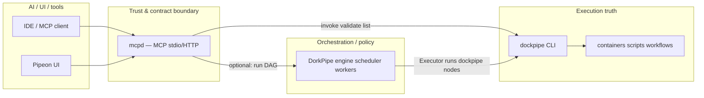

# MCP integration — DockPipe · DorkPipe · Pipeon

This document describes the **Model Context Protocol (MCP)** layer as a **bounded, dumb interface** over the existing system. MCP is **not** a second orchestrator and **does not** replace internal DorkPipe → DockPipe paths.

---

## 1. Mental model (components)

| Layer | Role |
|--------|------|
| **DockPipe** | **Execution truth:** workflows, resolvers, runtimes, `docker run`, host scripts, artifacts under `.dockpipe/` / project dirs. |
| **DorkPipe** | **Orchestration / control:** DAG specs, decomposition, policy hooks, node routing, confidence — **Executor** still calls **`dockpipe`** (or other node kinds) as today. |
| **MCP (`mcpd`)** | **Structured contract:** discovery, typed invocation, structured results. Translates MCP tool calls into **CLI-shaped** or **library-shaped** calls into DockPipe/DorkPipe — **no duplicated business rules**. |
| **Pipeon** | **Product / UX:** may call MCP for deterministic actions and share the same capability surface with AI. |

**Internal path (unchanged):** DorkPipe `workers.Executor` → `dockpipe` subprocess for `kind: dockpipe` nodes. **That path does not go through MCP.**

**External path:** MCP clients → `mcpd` → `dockpipe` / `dorkpipe` binaries (or small read-only library use for discovery only).

---

## 2. Capability model

### Discovery

- Capabilities are **named tools** with JSON Schema **input** descriptors.
- **Source of truth** remains the repo + bundled layouts (`src/templates/`, `workflows/`, `DOCKPIPE_REPO_ROOT`), not prose in `AGENTS.md`.
- Optional bootstrap: `docs/examples/mcp-capabilities.bootstrap.json` (see repo) — **pointer only**, not a second registry to maintain long-term if the server can derive lists at runtime.

### Invocation

- Each tool maps to **one of**:
  - **`dockpipe …`** with a **fixed argv template** + validated parameters (workflow name, `--workdir`, command argv).
  - **`dorkpipe …`** similarly bounded (`validate`, `run` behind a flag).
  - **Read-only library calls** for listing workflow names (`infrastructure.ListWorkflowNamesInRepoRoot`) — **discovery only**, no execution semantics duplicated.

### Results

- Tools return **MCP `CallToolResult`**: text JSON summaries plus optional **artifact paths** and **exit codes** parsed from CLI stderr/stdout where applicable.
- Long-running / large artifacts: return **paths** and **run ids** (e.g. `.dockpipe/` files), not bulk binary in MCP.

---

## 3. Authentication / trust (practical, layered)

| Boundary | Responsibility |
|----------|----------------|
| **MCP (`mcpd`)** | **Authentication:** HTTP(S) — **`MCP_HTTP_API_KEY`** (single key) **or** **`MCP_HTTP_KEY_TIERS_FILE`** (JSON: multiple keys → different tiers). **`Authorization: Bearer`**, **`ApiKey`**, **`X-API-Key`**. **HTTPS** unless **loopback-only** plain HTTP (`MCP_HTTP_INSECURE_LOOPBACK`). **Stdio:** trust parent process. |
| **DorkPipe** | **Policy / orchestration** (DAG structure, node gating) — unchanged. |
| **DockPipe** | **Executes only what the CLI would execute** given the same flags; no “MCP bypass.” |

- **IAM tiers:** `DOCKPIPE_MCP_TIER` = **`readonly`** | **`validate`** | **`exec`** (plus optional **`DOCKPIPE_MCP_ALLOWED_TOOLS`** comma allowlist to narrow further). Legacy **`DOCKPIPE_MCP_ALLOW_EXEC=1`** maps to **`exec`** when the tier env is unset. Default tier is **`validate`** (validate tools on; run tools off). **On-disk** `.dockpipe/` / `.dorkpipe/` artifacts are **context**, not MCP; see **`docs/mcp-agent-trust.md`**.

---

## 4. Go layout (implemented)

| Path | Purpose |
|------|---------|
| `src/lib/mcpbridge/` | MCP JSON-RPC over stdio (Content-Length framing), tool registry, dispatch to `dockpipe`/`dorkpipe`, discovery helpers. |
| `src/cmd/mcpd/` | Thin entrypoint: stdio (`NewServer(Version).ServeStdio`) or HTTPS (`ServeHTTP`). |
| `docs/mcp-architecture.md` | This document. |
| `docs/examples/mcp-capabilities.bootstrap.json` | Optional minimal manifest pointer for agents. |

**Dependency rule:** `mcpbridge` may import **`dockpipe/.../infrastructure`** only for **read-only** discovery aligned with the CLI. Execution stays in **subprocess** `dockpipe` / `dorkpipe` to avoid forking behavior inside the library.

---

## 5. Shared “lightweight service” container (deployment sketch)

**Goal:** one small image that runs **`mcpd`** and a **Pipeon-facing HTTP bridge** (future `pipeon-bridge` or reuse `mcpd` HTTP mode) so Pipeon-managed environments don’t need one container per concern.

**Inside the shared service container (lean):**

- `mcpd` (stdio or HTTP adapter in front of the same handlers).
- Optional **reverse proxy** (e.g. Caddy/nginx) in front of `mcpd -http` for extra policy, or terminate TLS in `mcpd` via **`MCP_TLS_*`**.
- **No** Ollama, Postgres, Playwright, or heavy browsers — those stay **sidecars** or **host** services.

**Outside:**

- Docker socket (if DockPipe runs containers from this host).
- Optional Ollama / DB / browser automation — separate containers or host installs.

This is **packaging convenience**, not an architectural merge.

---

## 6. Minimal first tool set (v1)

| Tool | Behavior | Min tier |
|------|----------|----------|
| `dockpipe.version` | `dockpipe --version` | **readonly** |
| `capabilities.workflows` | List workflow names (repo root resolution) | **readonly** |
| `dockpipe.validate_workflow` | `dockpipe workflow validate` on a path | **validate** |
| `dorkpipe.validate_spec` | `dorkpipe validate -f <spec>` | **validate** |
| `dockpipe.run` | `--workflow` + `--workdir` + argv after `--` | **exec** |
| `dorkpipe.run_spec` | `dorkpipe run -f <spec>` | **exec** |

Optional **`DOCKPIPE_MCP_ALLOWED_TOOLS`** intersects with the tier (subset only).

Future increments: artifact fetch (read paths under workdir), app-category workflows, diff summaries — still **thin wrappers** over existing CLIs or read-only FS.

---

## 7. Migration / rollout (low risk)

1. Ship **`mcpd`** and docs; **no** change to default `dockpipe` / `dorkpipe` CLIs.
2. Pipeon / IDE: opt-in MCP config pointing at `mcpd` stdio or HTTP.
3. Add tools incrementally; keep **exec** behind **`DOCKPIPE_MCP_TIER=exec`** (or legacy **`DOCKPIPE_MCP_ALLOW_EXEC`** when tier is unset).
4. Internal DorkPipe DAG runs **unchanged** — no MCP on the hot path.

---

## 8. Non-goals (recap)

- Rewriting DockPipe or DorkPipe into MCP.
- MCP as universal orchestration.
- Duplicating **`AGENTS.md`**-sized prose inside MCP — use **artifacts** + **bounded tools**; see **`docs/mcp-agent-trust.md`**.
- Host shell execution from MCP except via **explicit** `dockpipe`/`dorkpipe` invocation with gates.

---

## 9. Pipeon alignment

- **Same tool surface** for UI automation and AI: call MCP tools by name with structured JSON.
- **DockPipe** remains how work actually runs; Pipeon never “shells out” arbitrarily — it uses **named capabilities** (MCP tools) that map to CLI entrypoints.

---

## 10. Keeping MCP dumb

- **No** scheduling DAGs inside MCP — use **DorkPipe** for DAGs.
- **No** workflow YAML parsing in MCP beyond passing paths — **DockPipe** validates.
- **One** mapping layer: tool name → argv + env; structured JSON in/out.

See `src/lib/mcpbridge/README.md` for implementation notes.

---

## 11. Agent trust (short)

**Default MCP session (`DOCKPIPE_MCP_TIER` unset):** tier **`validate`** — version, workflow list, and both validate tools; **no** run tools unless tier **`exec`** (or legacy **`DOCKPIPE_MCP_ALLOW_EXEC=1`** when tier is unset). Use **`readonly`** to strip validate tools. **`.dockpipe/`** / **`.dorkpipe/`** remain **read context**. Full write-up: **`docs/mcp-agent-trust.md`**.
