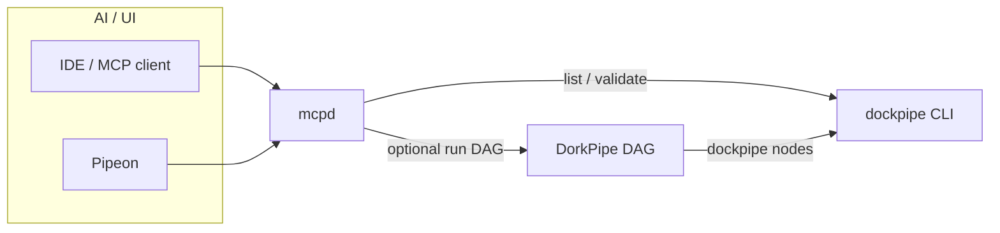

# `dorkpipe-mcp` (`dorkpipe.mcp`)

Maintainer package: **MCP bridge** for DockPipe / DorkPipe — Go module **`dorkpipe.mcp`**, library **`mcpbridge/`**, binary **`cmd/mcpd`**.

- **`go.work`** at the repo root includes this module next to **`dockpipe`** and **`dorkpipe.orchestrator`**.
- **`replace dockpipe => ../../../..`** in **`go.mod`** pins the engine for **`dockpipe/.../infrastructure`** imports.

The **`mcpd`** binary is built into **`dorkpipe-mcp/bin/mcpd`** (next to this module). It is **not** copied under **`src/bin/`** — point Cursor / env at this path (see **`src/Makefile`**).

**Implementation detail:** **`mcpbridge/README.md`** (env, HTTP mode, Cursor).

---

## Role

The **Model Context Protocol** bridge is a **thin** JSON-RPC layer over **`dockpipe`** / **`dorkpipe`** — not a second orchestrator. Internal DorkPipe **`Executor` → `dockpipe` subprocess** does **not** go through MCP.

| Layer | Role |
|--------|------|
| **DockPipe** | Execution truth: workflows, containers, `.dockpipe/`. |
| **DorkPipe** | DAG / policy; still shells **`dockpipe`** for tool steps. |
| **MCP** | Discovery + typed calls → same CLIs a human would run. |

**Three different things:** (1) **`.dockpipe/` / `bin/.dockpipe/packages/dorkpipe/`** = generated context — read-only for agents unless the user refreshes. (2) **MCP** = named tools + **tiered IAM**. (3) **DockPipe/DorkPipe** = real execution — outside MCP unless tier **`exec`**.

## Tools and tiers

| Tool | Tier (min) |
|------|------------|
| `dockpipe.version`, `capabilities.workflows` | **readonly** |
| `dockpipe.validate_workflow`, `dorkpipe.validate_spec` | **validate** |
| `dockpipe.run`, `dorkpipe.run_spec` | **exec** |

**`DOCKPIPE_MCP_TIER`:** `readonly` \| `validate` \| `exec`. Precedence: env tier → else `DOCKPIPE_MCP_ALLOW_EXEC=1` → **exec** → else default **`validate`**. Optional **`DOCKPIPE_MCP_ALLOWED_TOOLS`** narrows further.

HTTP: **`MCP_HTTP_API_KEY`** or **`MCP_HTTP_KEY_TIERS_FILE`** (per-key tiers). Stdio: trust the parent process. For org SSO at scale, terminate at a reverse proxy — not inside **`mcpd`**.

## Host hardening (defaults on)

| Variable | Effect |
|----------|--------|
| **`DOCKPIPE_MCP_RESTRICT_WORKDIR`** | Exec tools keep workdir under repo root (default **on**). |
| **`DOCKPIPE_MCP_REQUIRE_ABSOLUTE_BIN`** | Require absolute **`DOCKPIPE_BIN`** / **`DORKPIPE_BIN`** (default **on**). |

Set **`DOCKPIPE_BIN`** and **`DORKPIPE_BIN`** to the absolute executables you want MCP to launch. In this repo after **`make build`** + **`make maintainer-tools`**, that is typically **`src/bin/dockpipe`** and **`packages/dorkpipe/bin/dorkpipe`**.

**`mcpbridge`** may import **`dockpipe/.../infrastructure`** for **read-only** discovery only; execution stays subprocess-based.

Optional bootstrap manifest (repo checkout): **`docs/examples/mcp-capabilities.bootstrap.json`**.

**Non-goals:** Rewriting the engine as MCP; DAG scheduling inside MCP; arbitrary host shell without **`dockpipe`/`dorkpipe`**.

## This repo (Cursor)

After **`make maintainer-tools`**, point **`command`** at **`dorkpipe-mcp/bin/mcpd`**. Default tier without env is **`validate`**; use **`DOCKPIPE_MCP_TIER=readonly`** for the smallest surface.

**See also:** repo **`docs/artifacts.md`** (governance / on-disk signals).
